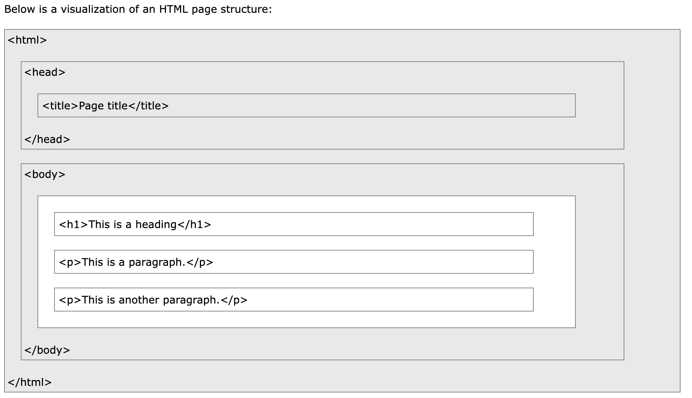

# Sprint 1 - Day 2

**HTML** describes the structure of a Web page and consists of a series of elements. Elements tell the browser how to display the content.

## Page Structure



## Elements

An HTML **element** is defined by a start tag, some content, and an end tag.

```html
<tagname>Content goes here...</tagname>

<!-- I am comment -->

<!-- example elements: -->
<h1>My First Heading</h1>
<p>My first paragraph.</p>
```

## Attributes

HTML **attributes** provide additional information about HTML elements. Attributes are always specified in the start tag. Attributes usually come in name/value pairs like: `name="value"`.

### href

The `<a>` tag defines a hyperlink. The href attribute specifies the URL of the page the link goes to:

```html
<a href="https://www.w3schools.com">Visit W3Schools</a>
```

### src

The `` tag is used to embed an image in an HTML page. The src attribute specifies the path to the image to be displayed:

```html

```

### style

The HTML `style` attribute is used to add styles to an element, such as color, font, size, and more.

```html
<tagname style="property:value;">
```

The _property_ is a CSS property. The _value_ is a CSS value.

### id

The `id` attribute specifies a unique id for an HTML element. The value of the `id` attribute must be unique within the HTML document.

**The `id` attribute is used by JavaScript to access and manipulate the element with the specific id.**

The syntax for id is: write a hash character `#`, followed by an id name. Then, define the CSS properties within curly braces `{}`.

```html
<h1 id="myHeader">My Header</h1>
```
